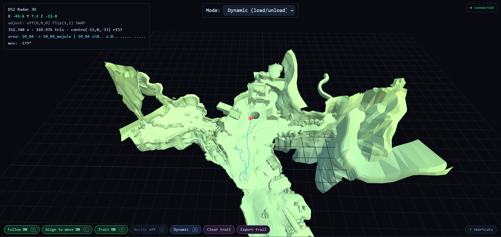
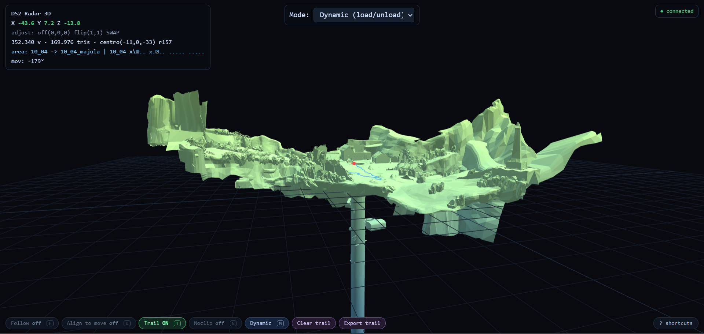
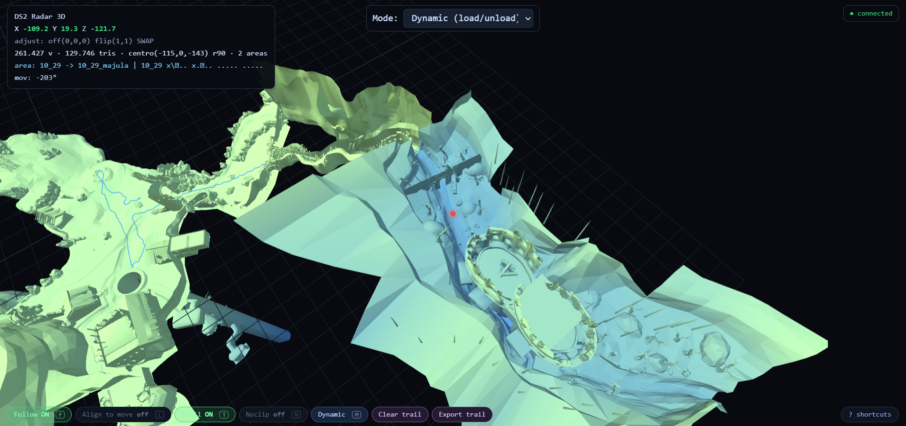

# DS2 Radar 3D

A real-time 3D radar for **Dark Souls II: Scholar of the First Sin** on a
jailbroken **PS4**. It reads your live player position from the game's memory
and shows it on the real 3D geometry of the game's maps, in your browser.

- Live player position + trail
- Automatic area switching (loads the right map as you move)
- Full-world view (all 24 areas at once) or dynamic (nearby only)
- Free camera: orbit, pan, zoom, and a noclip fly mode
- **Bundled interactive POI map** — ~680 points of interest (bonfires, chests, bosses with names, fog gates / illusory walls, item pickups) auto-extracted from the game's map data and pinned on the 3D world; filter by category
- **Markers / points of interest** — drop your own bosses, items, NPCs, bonfires and more on the 3D map, with emoji icons, floating labels, per-category filters, and export/import (JSON)
- "Align to movement" mode, per-area show/hide panel, trail export (CSV)

> ⚠️ Read-only tool for personal/offline use. Don't use it online.

---

## Status & compatibility

This is the **v1.02** community release. It is **fully tested and confirmed working
on Dark Souls II: Scholar of the First Sin — CUSA01760, patch 1.02** (the version
the bundled `config.ini` is validated for). On that version everything works
perfectly.

**We have NOT tested any other version, region or patch.** In particular:

- The **finder** tools (`finder/`) *should* generate a working config for other
  builds, but we haven't verified that on anything else.
- The **map geometry** *should* be identical across versions, but we haven't
  verified that either.

So on a different build, treat it as **experimental — test it yourself**. If it
works, please share your `config.ini` (with the CUSA + patch) so others benefit.

---

## Screenshots


*Live position (red dot) and trail on Majula's real 3D geometry.*


*Free camera — orbit, pan and zoom around the map at any angle.*


*Two connected maps loaded as you move between areas.*

---

## Requirements

**PS4 (jailbroken, GoldHEN):**
- The **ps4debug** payload. Standard on a jailbroken PS4; there are many ways to
  send it (payload menus / GoldHEN / a homebrew that sends payloads). Just search
  **"load ps4debug payload GoldHEN"**. Use the build that matches your firmware
  (e.g. the ctn123 & SiSTRo build for FW 9.00). **This step is mandatory** — the
  radar talks to the PS4 through ps4debug.

**PC:**
- Python 3.9+  ·  `pip install -r requirements.txt`  (ps4debug, websockets, numpy)
- A modern browser (Chrome/Edge/Firefox).

---

## Setup (once)

1. Install the Python dependencies:
   ```
   pip install -r requirements.txt
   ```
2. Open **`config.ini`** and set your PS4 IP:
   ```
   [ps4]
   ip = 192.168.1.104
   ```
   The rest of `config.ini` is already filled in and validated for
   **Dark Souls II SotFS, CUSA01760, patch 1.02**. If your game is a different
   version, see [Different game version](#different-game-version) below.

## Run (every time)

3. On the PS4, **load the ps4debug payload** (see Requirements).
4. **Open the game** and load your save.
5. On the PC, start the server:
   ```
   python server.py
   ```
6. Open **http://localhost:8080/radar.html** in your browser.

Position and area show up automatically, and keep working after a game reboot
(the position uses a static pointer chain). Keep **PS4CheaterNeo closed** while
the server or the finder tools are running.

---

## Different game version

The map geometry is the same for everyone, but the **memory offsets** differ per
build. Generate a fresh `config.ini` with the finder (two stages, because a
reboot is what proves the pointer chain is permanent):

1. **Stage 1** — game running, standing in **Majula**:
   ```
   python finder/finder_scan.py
   ```
   Follow the on-screen steps: stand still, take a few steps, keep walking (finds
   your position); then capture the current area, travel to a second area and
   capture it (finds the area names); then it pointer-scans. Saves `finder_state.json`.
2. **Reboot the game.**
3. **Stage 2** — after the reboot, in an open area:
   ```
   python finder/finder_validate.py
   ```
   Walk in circles when asked. It writes **`config.generated.ini`** in this folder.
4. Rename `config.generated.ini` to `config.ini` (replace the old one) and put
   your CUSA/patch in the `[info]` section.

If stage 2 says "0 chains tracked", just rescan (stage 1) and try again.

---

## Controls (in the browser)

- **Left-drag** orbit · **Right-drag / Middle-drag / Shift+Left-drag** pan · **Scroll** zoom
- **F** follow player · **L** align to movement · **N** noclip (WASD/QE to fly, Shift = faster)
- **M** switch mode (Dynamic / Whole world) · **T** trail on/off · **[ ]** dot size
- Bottom chips show state (green = ON). The **? shortcuts** button lists everything.
- In "Whole world" mode: **Areas** panel to show/hide/isolate maps, **Clear trail**
  and **Export trail** (CSV with real in-game X,Y,Z).
- **Markers ▾** panel: **＋ Add here** drops a marker at your live position ·
  **📌 Place on map** then click the 3D geometry · pick a category (boss, item,
  NPC, bonfire…) · click a category chip to show/hide it · toggle floating
  **Labels** · **Export/Import** your markers as JSON. Markers are saved in the
  browser (localStorage) and only draw over the area that's currently loaded.

---

## Project layout

```
server.py            Backend: reads PS4 memory, serves the page, WebSocket. Run this.
radar.html           The 3D radar (Three.js front-end)
three.min.js         Three.js (bundled, offline)
config.ini           Per-version offsets (position chain + area addresses). Edit your IP here.
maps/                Map geometry — areas.json + <area>_v.bin / _i.bin (same for all versions)
pois/                Bundled POI pack (ds2_pois.json — bonfires, chests, bosses, fog/walls, loot)
finder/              Generate config.ini for a new version (finder_scan.py, finder_validate.py)
tools/               Raw building blocks (position finder, pointer scan, map dump…)
tests/               pytest integrity tests for the POI dataset
screenshots/         Images used in this README
```

---

## How it works (short version)

- **Position:** a static pointer chain rooted in the eboot's data segment
  (`base = *( *(eboot_base + static_off) + off0 ) + off1 …`) resolves to a
  `[1.0, X, Y, Z]` block. Re-resolved every tick, so it follows the game's memory
  reallocations and survives reboots.
- **Area:** the game keeps the current map name as ASCII (`"10_04"`) in static
  eboot data; the server reads it and the page loads the matching mesh.
- **Geometry:** decoded from the `dks2mv` map-viewer `.iv` files. The memory↔mesh
  transform is a simple X↔Z swap.

---

## How this started

The project began as a plain **2D minimap**. The problem: getting a 2D map image
that actually lined up with the game's real coordinates was a nightmare — the maps
we could find never matched the world. Then we found the **3D model of the game's
maps** (the `dks2mv` map-viewer geometry), and everything clicked: instead of
fighting a flat image, we could drop the player straight onto the real 3D geometry.
That detour turned a simple minimap into this full 3D radar.

## Changelog

### v1.02
- **Bundled interactive POI map** — ~680 pins auto-extracted from the game's map
  data (MSB): every bonfire, chest, boss (named), fog gate / illusory wall, and
  item pickup, placed on the 3D world. Loaded from `pois/ds2_pois.json`; filter by
  category in the Markers panel.
- **"Remember" toggle** (bottom-right chip) — persists your filters, labels, mode,
  dot size and view toggles across reloads.
- **Sticky Follow / Align** — with Follow or Align ON you can now freely drag/orbit
  the camera; it resumes following/aligning as soon as the player moves.
- New marker categories: **Chest** 🧰 and **Fog / Wall** 🌫️.
- Added `tests/` (pytest) for POI dataset integrity.

### v1.01
- **New: Markers / points of interest.** Drop markers on the 3D map — bosses,
  enemies, items, key items, NPCs, bonfires, shortcuts, secrets, notes — each with
  its own emoji icon and color. Add one at your live position (**＋ Add here**) or
  click the map (**📌 Place on map**), filter by category, toggle floating labels,
  and export/import the whole set as JSON. Markers persist in the browser.
- **Follow now survives a teleport.** With **Follow ON**, warping in-game (or any
  big position jump / area change) snaps the camera back onto the player instead of
  staying on the now-unloaded old spot. With Follow OFF the view stays put, as before.
- **Player dot scales with zoom.** The dot and its ring now keep a roughly constant
  on-screen size — readable up close *and* when zoomed far out (the markers already
  did this). `[` / `]` still resize it on top of that.
- Small UX polish: shortcuts are ignored while typing in a text field, and the
  whole-world loader stops cleanly when you switch back to dynamic mid-load.

### v1.0
- First public release. Live position + trail, automatic area switching,
  dynamic / whole-world modes, free camera with noclip, align-to-movement,
  per-area panel, CSV trail export. Validated on CUSA01760, patch 1.02.

## Contributing

This is an open-source community project — contributions are welcome! Whether it's
a **config.ini for another game version/region** (share it with the CUSA + patch),
bug fixes, or new features, feel free to open an issue or a pull request.

## Credits

- **dks2mv — Dark Souls Map Viewer** — the `.iv` map geometry the 3D world is built from.
- **ps4debug** (jogolden) and the FW 9.00 build by **ctn123 & SiSTRo** — PS4 memory access.
- **Python `ps4debug` library** — the PC-side binding used by the server.
- **GoldHEN** — the jailbreak / payload environment.
- **Three.js** — 3D rendering in the browser.
- **DS2S-META** (Nordgaren) — reference for Dark Souls II memory research.
- **Dark Souls II: Scholar of the First Sin** © FromSoftware / Bandai Namco.
  This is an unofficial fan-made tool, not affiliated with or endorsed by them.

## License

MIT — see [LICENSE](LICENSE). Do what you want, just keep the notice.
